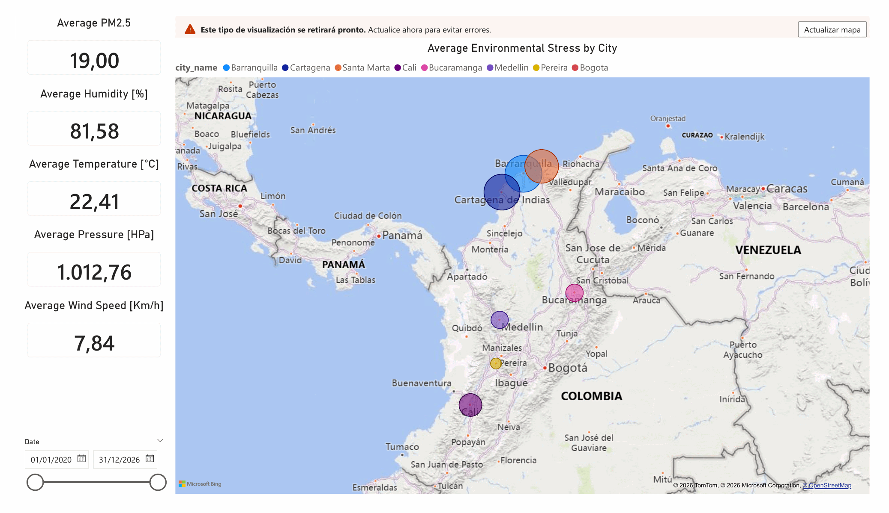

# colombia-env-data-pipeline
A production-grade, end-to-end data engineering project that ingests, stores, transforms, and visualises **weather** and **air-quality** data for the eight largest cities in Colombia.

Built as the capstone project for the [DataTalksClub Data Engineering Zoomcamp](https://github.com/DataTalksClub/data-engineering-zoomcamp).


## Table of Contents
- [Problem statement](#problem-statement)
- [Questions the dashboard answers](#questions-the-dashboard-answers)
- [The 8 cities](#the-8-cities)
- [Repository layout](#repository-layout)
- [System Architecture](#system-architecture)
- [Dashboard](#dashboard)
- [Quick start](#quick-start)
- [How each zoomcamp module is covered](#how-each-zoomcamp-module-is-covered)
- [Operational notes](#operational-notes)
- [What I would add next](#what-i-would-add-next)
- [Acknowledgements](#acknowledgements)

---
## Problem statement
Colombia is a country of dramatic environmental diversity: Bogotá sits at 2,640 m and rarely breaks 20 °C, Barranquilla sits at sea level and rarely drops below 25 °C, and Medellín — the "city of eternal spring" — is wedged between mountains that trap pollution in predictable patterns. Air quality and climate are closely tied to **elevation**, **time of year**, and **population density**, but that relationship is hard to see without aligning multiple datasets on a consistent schema.

This pipeline does that:
1. Pulls **historical hourly weather** (back to 2020) from [Open-Meteo](https://open-meteo.com).
2. Pulls **daily ground-station air quality** (PM2.5, PM10, O₃, NO₂, SO₂, CO) from [OpenAQ v3](https://docs.openaq.org).
3. Simulates a **real-time IoT sensor stream** through Kafka.
4. Lands everything as partitioned parquet in GCS, exposes it via BigQuery external tables, and shapes it with dbt into dashboard-ready facts.
5. Runs a monthly Spark job for heavy historical aggregations (climate normals, 30-day rolling windows, heat-wave detection).
6. Surfaces the result in a Looker Studio dashboard.


### Questions the dashboard answers
- How does each city's air quality rank against WHO guidelines?
- Where and when do heat waves hit hardest, and are they getting longer?
- Which cities have the worst combined **environmental stress** (heat + humidity + pollution)?
- How does pollution correlate with rainfall across climate zones?


### The 8 cities
Chosen to span Colombia's five climate zones (*tierra caliente* to *paramo*) and capture ~50% of the country's population.

| City          | Department       | Elevation | Population | Climate zone          |
|---------------|------------------|-----------|------------|-----------------------|
| Bogotá        | Cundinamarca     | 2,640 m   | 7.7 M      | Tierra muy fría       |
| Medellín      | Antioquia        | 1,495 m   | 2.6 M      | Tierra templada       |
| Cali          | Valle del Cauca  | 1,000 m   | 2.2 M      | Tierra templada       |
| Barranquilla  | Atlántico        | 18 m      | 1.3 M      | Tierra caliente       |
| Cartagena     | Bolívar          | 2 m       | 1.1 M      | Tierra caliente       |
| Bucaramanga   | Santander        | 959 m     | 0.6 M      | Tierra templada       |
| Pereira       | Risaralda        | 1,411 m   | 0.5 M      | Tierra templada       |
| Santa Marta   | Magdalena        | 6 m       | 0.5 M      | Tierra caliente       |


---
## Repository layout

```
colombia-environmental-pipeline/
├── terraform/                      # GCS bucket + BigQuery datasets creation
├── ingestion/                      # Python containers for weather + air quality
│   ├── utils/                      #   shared helpers (cities, GCS)
│   ├── weather/                    #   historical + daily fetchers
│   ├── air_quality/                #   OpenAQ v3 fetcher
│   ├── Dockerfile
│   └── requirements.txt
├── kestra/                         # Orchestration
│   ├── docker-compose.yaml
│   └── flows/                      #   00-setup, 01-backfill, 02-daily, 03-aq, 04-dbt, 05-spark
├── dbt/                            # Transformations
│   ├── dbt_project.yml
│   ├── profiles.yml
│   ├── packages.yml
│   ├── macros/
│   ├── seeds/                      #   aux files (cities)
│   └── models/
│       ├── staging/                #   stg_weather, stg_air_quality
│       ├── intermediate/           #   int_weather_deduped, int_*_daily
│       └── marts/                  #   dim_cities, fct_weather_daily, fct_air_quality_daily, fct_environmental_stress
├── spark/                          # Heavy historical aggregations
│   ├── jobs/
│   └── deploy.sh
├── kafka/                          # Streaming
│   ├── docker-compose.yaml
│   ├── producer/                   #   Open-Meteo → Kafka
│   └── consumer/                   #   Kafka → GCS parquet
├── docs/
│   ├── architecture.md
│   ├── dashboard.md
│   └── troubleshooting.md
├── images/                         # Evidences of the pipeline processing
├── .env
├── .gitignore
├── LICENSE
├── Makefile
└── README.md
```


---
## System Architecture
This pipeline implements a **modular, cloud-native data engineering architecture** that follows industry best practices for handling environmental data at scale.

### Overview
The system is built on **seven key layers**:
1. **Sources** — External APIs (Open-Meteo for weather, OpenAQ v3 for air quality).
2. **Orchestration** — Kestra orchestrates scheduled ingestion and transformations.
3. **Streaming** — Kafka producer simulates real-time IoT sensor readings into a message broker.
4. **Storage** — GCS data lake with hive-style partitioning for efficient querying.
5. **Warehouse** — BigQuery with external tables for cost-effective raw storage.
6. **Transformation** — dbt models organized in staging → intermediate → marts layers.
7. **Compute** — PySpark jobs for complex historical aggregations (rolling windows, heat-wave detection).
8. **Visualization** — Power BI dashboard surfaces insights.

### Data Flow
- **Batch ingestion**: Kestra pulls historical and daily data from Open-Meteo and OpenAQ, landing parquet files in GCS.
- **Real-time streaming**: Kafka producer emits IoT sensor readings every few seconds; consumer batches them to GCS.
- **Transformations**: dbt models stack in three layers — staging models clean and union all sources, intermediate models deduplicate and roll up to daily grain, and mart models create fact tables optimized for dashboards.
- **Advanced analytics**: PySpark computes climate normals and heat-wave patterns monthly, writing back to BigQuery.
- **Cost efficiency**: External tables point to GCS, so raw data stays cheap; marts are small, partitioned, and clustered for fast queries.

For a detailed technical breakdown, see [docs/architecture.md](docs/architecture.md).


---
## Dashboard
The analysis is visualized in an **interactive Power BI dashboard** that tracks environmental stress across Colombia's eight largest cities. The dashboard provides insights into weather patterns, air quality, and their combined impact.

For a detailed view of the dashboard, see [docs/dashboard.pbix](docs/dashboard.pbix).

### Dashboard View



### Dashboard Pages & Features
The dashboard is organized into **3 interactive pages**, all filterable by **date range** and **city selection**:


#### **Page 1: Weather Indicators**
Current-state snapshots of environmental conditions for each of the 8 Colombian cities:
- **Weather & Air Quality Metrics**: PM2.5, humidity, temperature, pressure, and wind speed.
- **Environmental Stress Score**: Composite metric (0–100) combining heat, humidity, and pollution.


#### **Page 2: Weather Tendencies Over Time**
Historical trends across the selected date range:
- **Time Trends**: Visualization to know the behaviour of some weather indicators.


#### **Page 3: Environmental & Weather Anomalies**
Detection and visualization of unusual conditions:
- **Heat Wave Detection**: Flags consecutive days where temperature exceeds the historical 95th percentile; shows count and duration.
- **Anomaly Indicators**: Statistical outliers for some weather indicators.


### Filters & Interactivity
- **Date Range Picker**: Select any period from 2020–present.
- **City Selector**: Multi-select to compare specific cities or focus on one region.


---
## Quick start

### Prerequisites
- A Google Cloud project with **billing enabled** and the following APIs on: Cloud Storage, BigQuery.
- Local tooling: **Docker**, **Docker Compose**, **Terraform ≥ 1.5**, **GNU Make**, **gcloud CLI**.
- A **service-account JSON key** with this permissions for GCS, BigQuery, and Dataproc.
- A free **OpenAQ API key** from [explore.openaq.org/register](https://explore.openaq.org/register).


### 1. Clone and configure
```bash
git clone https://github.com/<you>/colombia-environmental-pipeline.git
cd colombia-environmental-pipeline
```

```bash
# .env
GCP_PROJECT=<project-id>
GOOGLE_APPLICATION_CREDENTIALS=/absolute/path/to/key.json
GCS_BUCKET=<bucket-id>
BQ_REGION=<region>
RAW_DATASET=<raw_ds_name>
WAREHOUSE_DATASET=<wh_ds_name>
DATAPROC_REGION=<region>
DATAPROC_SERVICE_ACCOUNT=<account-name>@<project-id>.iam.gserviceaccount.com
OPENAQ_API_KEY=<api_key>
KAFKA_BOOTSTRAP=kafka-core:29092
KAFKA_TOPIC=weather.sensor.readings
EMIT_INTERVAL_SEC=2
BATCH_SIZE=100
BATCH_TIMEOUT_SEC=30
```

```bash
# terraform/terraform.tfvars
project_id     = "<project-id>"
region         = "<region>"
bucket_name    = "<bucket-id>"
dataset_prefix = "<prefix>"
create_service_account = <true/false>
```


### 2. Provision the cloud infrastructure
```bash
make tf-init
make tf-plan
make tf-apply
```
The output tells you the bucket name and dataset IDs — make sure they match
what's in your `.env`.


### 3. Build the container image for ingestion
```bash
make build-ingestion
```


### 4. Enable real-time data streaming
```bash
make kafka-up
```
This captures the data through the API as soon as it is updated in the web page


### 5. (Recommended) Run the process with Kestra orchestration
```bash
make kestra-up
```
1. Import the workflows in `kestra/flows/`.
2. Add the `gcp_credentials.json` file to the namespace files under the name `gcp-key.json` (this is necessary for the Python & dbt tasks).
3. Add the `dbt/` folder to the namesapce files under the name `dbt/` (this is neccessary for the dbt tasks).
4. Add KV pairs in the Store: GCP_PROJECT, GCS_BUCKET, BQ_REGION, RAW_DATASET, WAREHOUSE_DATASET, OPENAQ_API_KEY.
5. Run all the worflows in order.


### 6. (Optional) Run the process locally fot testing
```bash
# Extract raw data
make ingest-historical
make ingest-daily
make ingest-air-quality

# Transform with dbt
make dbt-build
```


### 7. Run the monthly aggregations with spark
```bash
make deploy-spark-job
make submit-spark-batch
```


---
## How each zoomcamp module is covered

### Module 1 — Infrastructure as Code
- **Docker**: every runtime (ingestion, producer, consumer) ships as a container with pinned dependencies. Kestra itself runs in a container with a Postgres metastore.
- **Terraform**: `terraform/main.tf` provisions a versioned, autoclass-enabled GCS bucket plus two BigQuery datasets. An optional service account with least-privilege IAM is gated behind a boolean variable.

### Module 2 — Workflow orchestration
- **Kestra** in standalone mode with a Postgres backend.
- Five flows with **schedules**, **subflow chaining** (daily ingestion → dbt), **retry policies**, and **error handlers**.
- The historical backfill flow accepts **inputs** for the date range, making it reusable for any time window.

### Module 3 — Data warehouse
- **BigQuery**, region-configurable.
- Raw data lives as **external tables** over hive-partitioned parquet in GCS — zero storage cost for the raw layer.
- Mart fact tables are **partitioned by month on `observation_date`** and **clustered by `city_id`** (and `parameter_name` where relevant). This brings typical dashboard query scans below 100 MB even across 5 years.

### Module 4 — Analytics engineering
- **dbt** with BigQuery adapter, three model layers (`staging` / `intermediate` / `marts`).
- `dbt_utils` package for surrogate keys and accepted-range tests.
- Tests: `unique`, `not_null`, `relationships`, `accepted_values`, and custom range checks on temperature and humidity.
- **Documentation** generated with `dbt docs` — served locally via `make dbt-docs`.
- A `dim_cities` dimension derived from a **seed** (`seeds/cities.csv`).

### Module 5 — Batch processing
- **PySpark 3.5** job containing four things dbt doesn't do as gracefully:
  1. Monthly climate normals against a long-run per-city baseline.
  2. 30-day rolling aggregates with **range-based windows** (not row-based — this matters when days are missing).
  3. Year-over-year anomalies.
  4. **Heat-wave detection** via a gap-and-islands pattern on consecutive high-temperature days.
- Output parquet is partitioned back by city and picked up by a BigQuery external table — no ETL round-trip.

### Module 6 — Streaming
- Producer fetches current weather every `EMIT_INTERVAL_SEC` and publishes keyed by `city_id` for ordering guarantees.
- Consumer uses **manual offset commits** — offsets are only committed after a successful GCS write, so crashes can't lose messages.
- Batch-by-size-or-time flushing strategy keeps file counts sane while bounding end-to-end latency.


---
## Operational notes

### Cost
With the default region (`us-central1`) and the 8-city volume, running costs
stay inside GCP's always-free tier or cents-per-month.

### Idempotency
- Every ingestion path writes to a **date-scoped parquet key**, so accidental re-runs overwrite in place rather than duplicating rows.
- dbt's intermediate `int_weather_deduped` deduplicates on `(city_id, observation_ts)` with latest-`ingested_at` wins, covering the seam between the historical backfill and the daily incremental.

### Monitoring
- Kestra surfaces every flow execution in its UI with full logs and timing.
- dbt tests catch schema drift, null explosions, or impossible values (negative humidity, -200 °C temperatures).


---
## What I would add next
Honest roadmap rather than a "future work" checkbox:
- **dbt snapshots** on `dim_cities` — the seed is static today but demographic changes over time would be good to track.
- **Great Expectations** or **dbt-expectations** on the raw layer for pre-dbt quality gates.
- **A dead-letter queue** in the Kafka consumer for malformed messages.
- **CI/CD**: a GitHub Actions workflow under `.github/workflows/` that runs `dbt build` against a dev dataset on every PR.
- **A proper unit-test suite** for the Spark aggregation logic. Right now the heat-wave detection is covered by visual inspection only.


---
## Acknowledgements

- [**DataTalksClub Data Engineering Zoomcamp**](https://github.com/DataTalksClub/data-engineering-zoomcamp) — course structure and learning path.
- [**Open-Meteo**](https://open-meteo.com) — free, unauthenticated weather APIs. Please cite them if you build on this.
- [**OpenAQ**](https://openaq.org) — open air quality data platform with a genuinely generous free tier.


---
## License
MIT