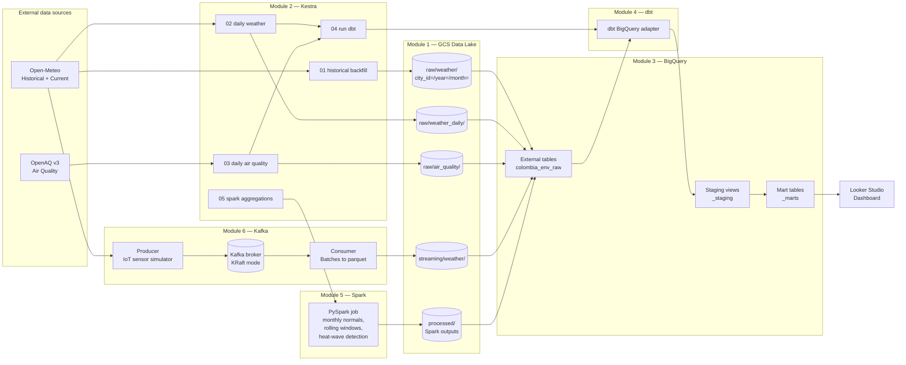

# Architecture
This document walks through the pipeline end-to-end, layer by layer.


---
## High-level flow



---
## Layer-by-layer

### 1. Sources
- **Open-Meteo** is used for historical hourly weather (`/v1/archive`) and current conditions (`/v1/forecast`) — no API key required.
- **OpenAQ v3** serves ground-station air quality (`/v3/locations`, `/v3/sensors/{id}/measurements/daily`) and requires a free API key in the `X-API-Key` header.


### 2. Orchestration (Kestra)
Four flows live under `kestra/flows/`. `03_setup_external_tables` is a one-shot DDL runner; the numbered rest of tht flows are the pipeline itself.


### 3. Storage (GCS)
A single bucket with a hive-style layout. The top-level prefix encodes the dataset family, then hive partitions let BigQuery external tables prune cheaply:
```
gs://$BUCKET/
├── raw/weather/city_id=BOG/year=2024/month=03/data.parquet
├── raw/weather_daily/year=2024/month=03/day=15/data.parquet
├── raw/air_quality/year=2024/month=03/day=15/data.parquet
├── streaming/weather/year=2024/month=03/day=15/batch_<epoch>.parquet
└── processed/weather_monthly/...   ← Spark writes here
```


### 4. Warehouse (BigQuery)
Two datasets groups:
- `colombia_env_raw` holds external tables pointing at the GCS layout above — no bytes are moved into BigQuery storage, which keeps costs near zero. `colombia_env_warehouse_` groupholds the materialised models that dbt & sparks build.


### 5. Transformation (dbt)
Three model layers:
- Staging unifies historical + daily + streaming feeds into a clean per-city view.
- Intermediate (ephemeral) deduplicates and rolls up to daily grain.
- Marts are two facts (`fct_weather_daily`, `fct_air_quality_daily`) plus a combined analytical table (`fct_environmental_stress`) that helps with analysis.

All mart facts are **partitioned by month on `observation_date` and clustered by `city_id`** — the two most common filter combinations. Typical dashboard queries scan <100 MB even with multi-year history.


### 6. Batch compute (Spark)
The Spark job computes things that are awkward in pure SQL: climate normals needing the full history to derive the baseline, 30-day rolling windows on timestamp ranges, and consecutive-day pattern detection for heat waves. Output parquet feeds back into the warehouse via adirect load to BigQuery tables.


### 7. Streaming (Kafka)
The producer hits Open-Meteo's current-weather endpoint every few seconds for each city and publishes to the `weather.sensor.readings` topic. The consumer buffers messages and flushes to GCS as parquet files, which BigQuery picks up via the `ext_weather_streaming` external table. End-to-end latency from sensor → dashboard is roughly `BATCH_TIMEOUT_SEC + query time` (~30 s by default).


---
## Design choices and trade-offs

**Why external tables instead of native BigQuery tables for raw?**
Cheaper, simpler backfill story, and the parquet files are independently consumable by Spark without duplicating data. The main cost is slightly slower queries, which doesn't matter for a warehouse this size.

**Why Kestra?**
The zoomcamp uses Kestra, and it's a better fit here — YAML flows, built-in Docker task runners, and no DAG Python-code boilerplate.

**Why both OpenAQ and Open-Meteo for air quality?**
We only use OpenAQ in this build, but Open-Meteo also ships a CAMS-based air quality API that needs no key. If OpenAQ's ground coverage is sparse in a given city, swapping that city's source is a one-line change in the ingestion script.

**Why a combined `fct_environmental_stress` instead of joining in the BI/Analytical tool?**
Looker Studio gets charged for every unique query shape, and joining the two big facts live would cost more than pre-computing. The combined table is small and cheap to re-materialise on every dbt run.

**Why use Dataproc and Spark for monthly aggregations?**
When we have a huge amount of data that is also difficult to process directly with SQL, Spark is one of the best options to do the transformations since it leverages in parallel processing. The election of Dataproc was just because is a native GCP service to create spark clusters and run jobs.